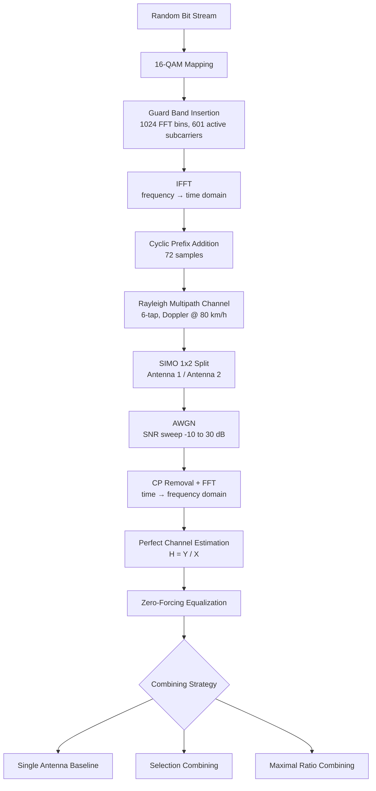

# Wireless Communication Channel Simulation — OFDM & SIMO Diversity Combining

A MATLAB simulation of a complete end-to-end OFDM communication link — from 16-QAM modulation through a realistic multipath/Doppler channel to SIMO diversity combining — quantifying how spatial diversity recovers data that a single-antenna receiver would lose entirely.

## Problem Statement

Modern wireless standards (4G LTE, 5G NR, Wi-Fi) rely on OFDM and multi-antenna (SIMO/MIMO) architectures to sustain high data rates in harsh radio environments. In reality, signals don't travel in a straight line — they bounce off buildings, terrain, and vehicles, producing **multipath fading**, where delayed copies of the same signal arrive and destructively interfere. A moving receiver (e.g. a car at 80 km/h) also experiences a **Doppler shift**, distorting the signal further.

This project simulates that environment mathematically to evaluate how severely a channel degrades a signal, and to test the countermeasures designed to fix it. By modeling AWGN, multipath delay, and Doppler shift, the simulation quantifies Bit Error Rate (BER) across a range of SNRs — and specifically tests how a **SIMO 1×2** system uses two receive antennas to exploit spatial diversity, recovering data a single antenna would have lost in a deep fade.

## System Pipeline

## Transmitter Design

- **Modulation:** random binary data mapped to a **16-QAM** constellation — every 4 bits form one complex symbol (phase + amplitude).
- **Guard bands:** symbols placed into a 1024-bin frequency grid, with only the central **601 subcarriers** active; edges zero-padded as **Virtual Subcarriers** to prevent out-of-band leakage and ease analog filter requirements.
- **IFFT:** converts the frequency-domain grid into a time-domain waveform, assigning each symbol to a mathematically orthogonal subcarrier.
- **Cyclic Prefix (CP):** the last **72 samples** of each OFDM symbol are copied to its start. A delayed multipath echo overlaps the CP instead of the next symbol's data — eliminating Inter-Symbol Interference (ISI).

## Channel Model

| Parameter | Value |
|---|---|
| Channel type | 6-tap Rayleigh fading |
| Max path delay | 450 ns |
| Carrier frequency | 1.8 GHz |
| Mobile velocity | 80 km/h |
| Receive antennas (SIMO) | 2 |
| SNR sweep range | -10 dB to 30 dB |

- **Multipath:** a 6-tap channel (`delayVector`, `gainVector`) models the signal arriving via 6 physical paths with independent delay and attenuation.
- **Doppler shift:** 80 km/h at 1.8 GHz causes the channel's phase and amplitude to fluctuate rapidly over time.
- **SIMO 1×2:** one transmit antenna, two physically separated receive antennas — each experiences independent fading, so a subcarrier destroyed on Antenna 1 may be intact on Antenna 2.
- **AWGN:** thermal/ambient noise added across the full SNR sweep to characterize performance under realistic conditions.

## Receiver: Estimation & Equalization

- **Demodulation:** CP is stripped (its job — absorbing delay spread — is done) and an FFT returns the signal to the frequency domain.
- **Channel estimation:** modeled as "perfect" for this simulation — $H = Y / X$, dividing the received grid by the known transmitted grid. (In a real system this uses known pilot symbols.)
- **Zero-Forcing Equalization:** the received signal is divided by $H$, inverting the channel's phase rotation and amplitude scaling to force scattered constellation points back to their original 16-QAM positions.

## SIMO Combining Techniques

| Strategy | Approach | Outcome |
|---|---|---|
| **Single Antenna (Baseline)** | Demodulates Antenna 1 only | Deep fades destroy data on affected subcarriers — high BER |
| **Selection Combining (SC)** | Compares instantaneous channel power `\|h\|²` per subcarrier across both antennas; selects the stronger one | Recovers data lost to fades, discards the weaker signal entirely |
| **Maximal Ratio Combining (MRC)** | Aligns both antennas' phases via `conj(h) .* y`, then weights by signal strength | Combines *both* signals constructively — highest achievable SNR, best BER performance |

## Results

| # | Plot | What It Shows |
|---|---|---|
| 1 | `` | Ideal 16-QAM Transmit Constellation Diagram — the undistorted baseline grid |
| 2 | `` | OFDM Subcarrier Allocation & Frequency-Domain Guard Bands |
| 3 | `` | Time-Domain OFDM Signal with Cyclic Prefix Boundaries marked |
| 4 | `` | Discrete CIR for the 6-Tap Rayleigh Fading Model |
| 5 | `` | Estimated CFR — visualizing frequency-selective deep fading nulls |
| 6 | `` | The channel interpolation for Equalization |
| 7 | `` | **BER vs. SNR** for Single Antenna, SC, and MRC — the key diversity-gain result |

The final BER-vs-SNR curve (Image 7) is the headline result: it demonstrates **diversity gain** — MRC and SC both substantially outperform single-antenna reception, with MRC achieving the steepest (best) curve by combining both signals constructively rather than discarding the weaker one.

## Tech Stack

`MATLAB` — Communications Toolbox (OFDM modulation, Rayleigh channel modeling, BER analysis)

## Key Takeaways

- Built a complete end-to-end OFDM link — modulation, IFFT/CP framing, multipath+Doppler channel, equalization, and BER analysis — entirely from first principles in MATLAB.
- Quantified the real performance gap between single-antenna reception, Selection Combining, and Maximal Ratio Combining across a full SNR sweep, confirming MRC's theoretical superiority with simulated data.
- Identified frequency-selective deep fading nulls in the channel frequency response and directly linked them to bit errors observed in the uncombined baseline.

## Next Steps

The script includes a placeholder for extending this SIMO (1×2) diversity setup into a **2×2 MIMO spatial multiplexing** configuration — transmitting independent data streams simultaneously on the same frequency to double throughput, rather than using the extra antenna purely for reliability.

## Author

Joel Joy — [LinkedIn](https://www.linkedin.com/in/joel70/) 
